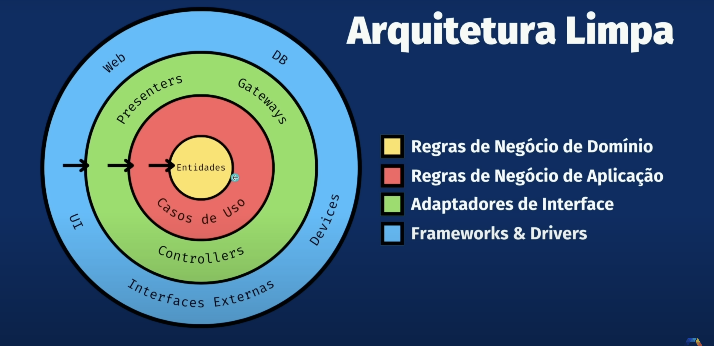

# Princípios de Arquitetura Clean-Arch

## Conceitos Básicos

### Entidade

> Entidade dentro do Clean-Arch é um componente que faz parte do domínio da aplicação. É onde inserimos as regras de negócio.

Características:

-
